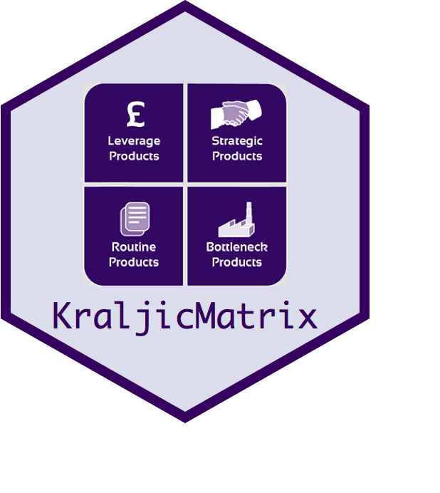

[](https://cran.r-project.org/package=KraljicMatrix)
[](https://travis-ci.org/koalaverse/KraljicMatrix) 
[](https://ci.appveyor.com/project/bradleyboehmke/kraljicmatrix) [](https://codecov.io/gh/koalaverse/KraljicMatrix)
[](http://joss.theoj.org/papers/10.21105/joss.00170)
[](http://cranlogs.r-pkg.org/badges/KraljicMatrix)
[](http://cranlogs.r-pkg.org/badges/grand-total/KraljicMatrix)


# KraljicMatrix 
 
`KraljicMatrix` is an R package for implementing Kraljic's (1983)[^kraljic] approach to strategically analyze a firm’s purchasing portfolio.  It has two main goals:

- Apply single and multi-attribute utility functions to rank-order products and services based on managerial preferences
- Align each product and service within Kraljic's purchasing matrix based on managerial preferences


## Installation

You can install `KraljicMatrix` two ways.

- Using the latest released version from CRAN:

```
install.packages("KraljicMatrix")
```

- Using the latest development version from GitHub:

```
if (packageVersion("devtools") < 1.6) {
  install.packages("devtools")
}

devtools::install_github("koalaverse/KraljicMatrix")
```

## Learning kraljicMatrix

To get started with `KraljicMatrix`, read the intro vignette: `vignette("kraljic", package = "KraljicMatrix")`.  This provides a thorough introduction to the functions provided in the package.  For deeper understanding behind the integration of single and multi-attribute utility thoery with the Kraljic Portfolio Matrix for strategic purchasing, read this [paper](https://www.dropbox.com/s/izxw97rjcu8e2t6/Article%20Submitted%20-%20Revised%20%282016-12-13.docx?dl=0).


[^kraljic]: Kraljic, P. (1983). Purchasing must become supply management. Harvard Business Review, 61(5), 109-117.
